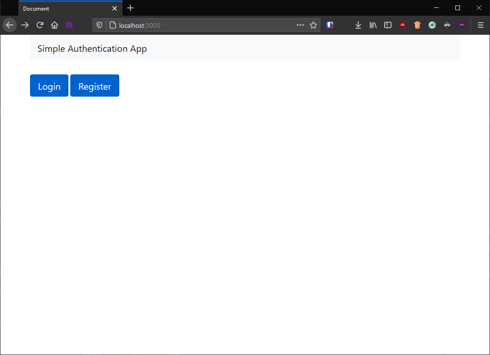
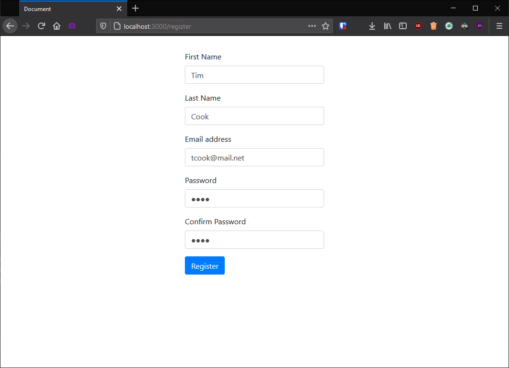
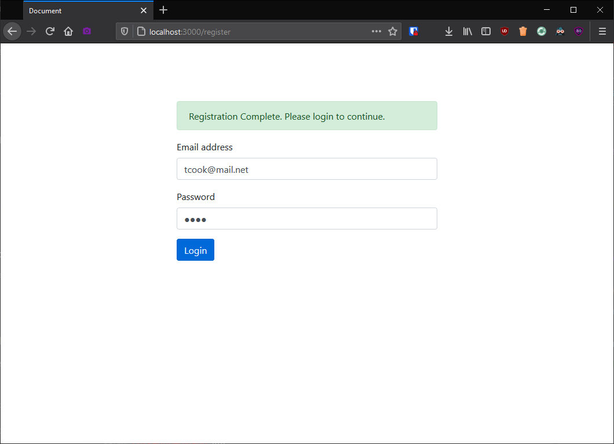
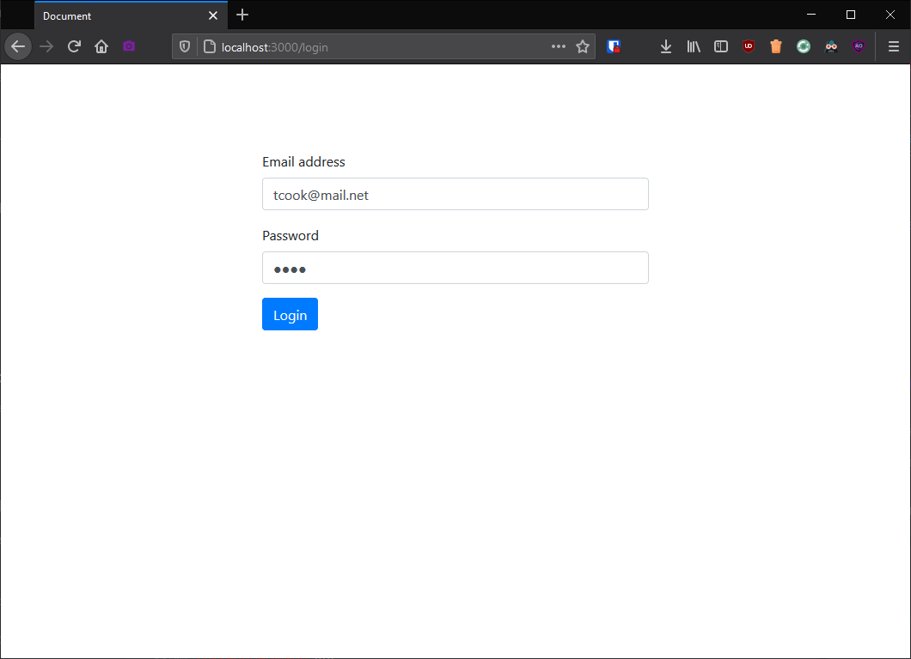
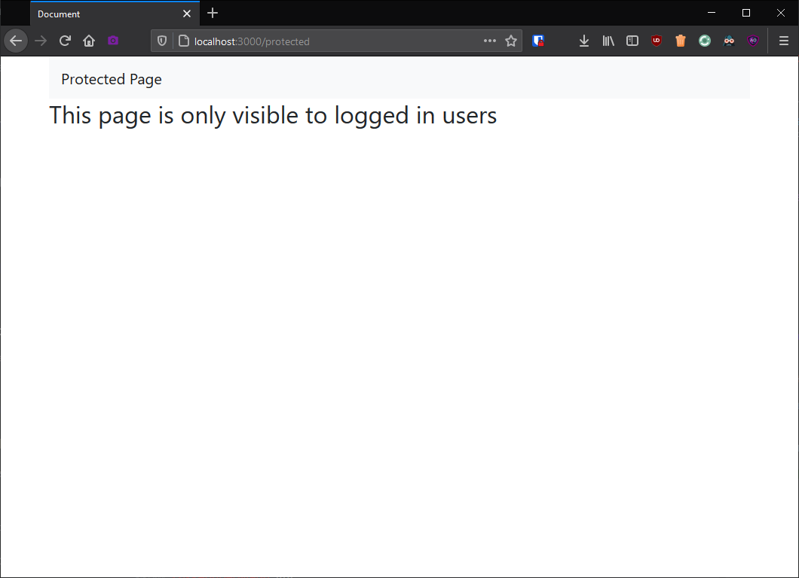

## Basic Authentication Screenshots
Assignment based on [this guide](https://stackabuse.com/handling-authentication-in-express-js/).

1. Homepage
   

2. Registration Page
   
   

3. Login Page (post-registration)
   

4. Login Page (direct)
   

5. Protected Page
   