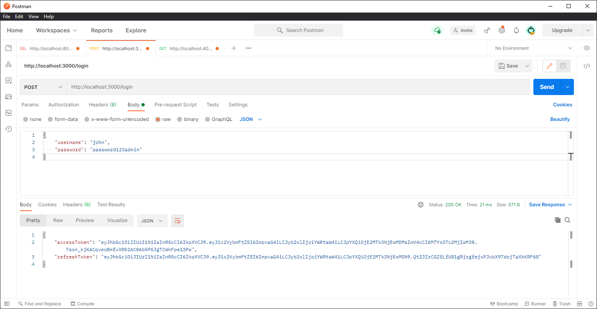
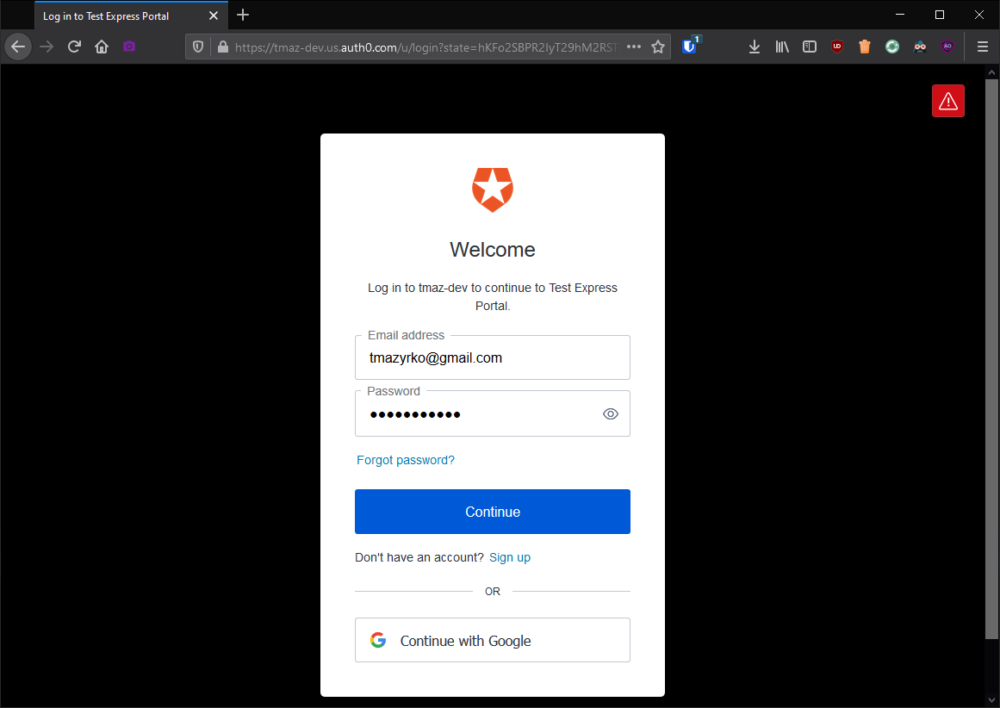
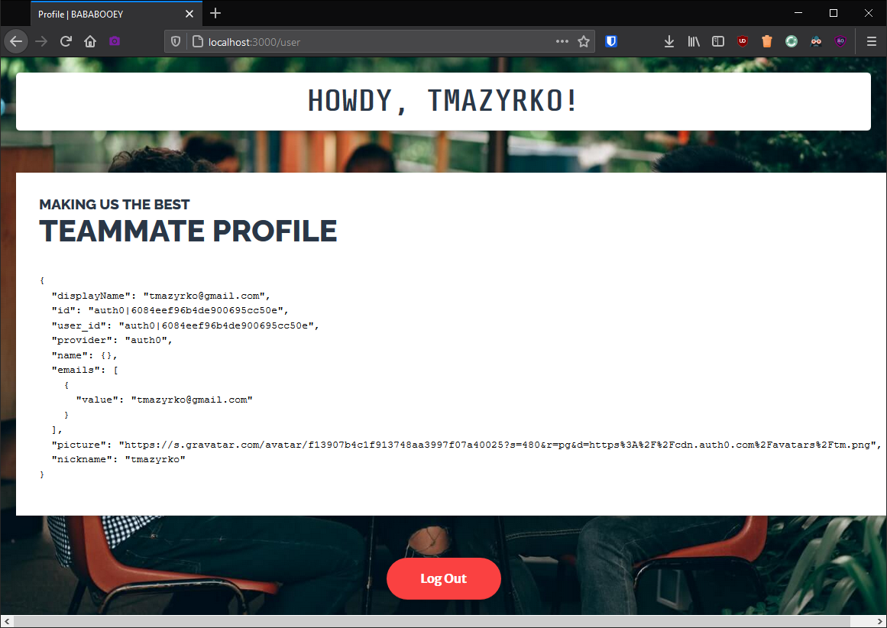
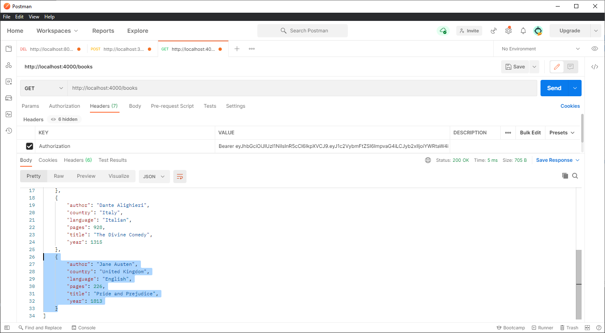
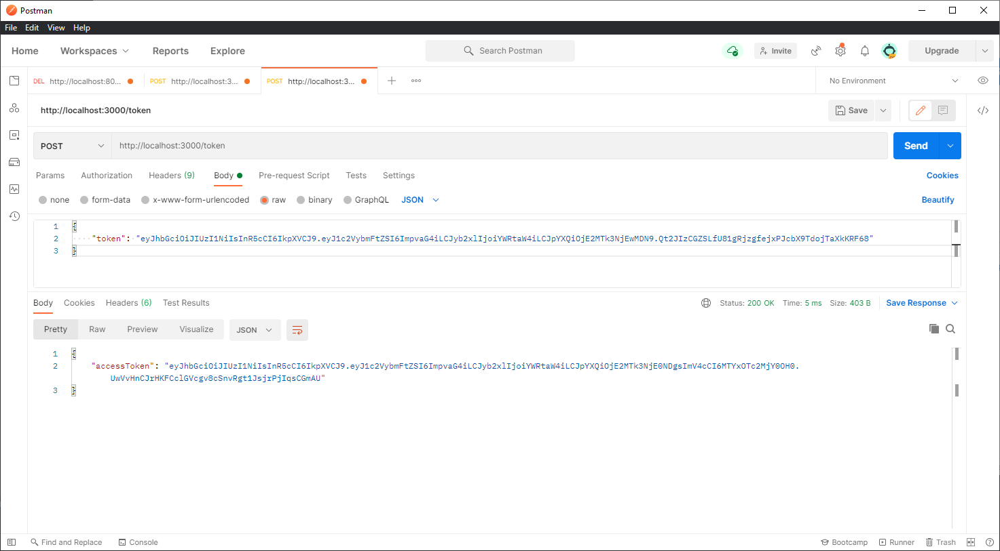
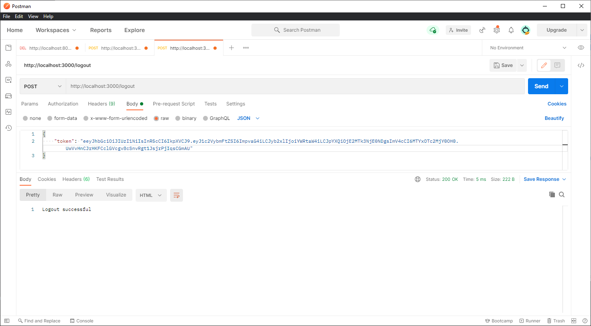

## JWT Authentication & Authorization

1. Login (POST request)
   

2. Retrieve database contents (GET request)
   
   

3. Add book to database (POST request)
   

4. Retrieve updated database (GET request)
   

5. Request new token using refresh token (POST request)
   

6. Logout (POST request)
   
   