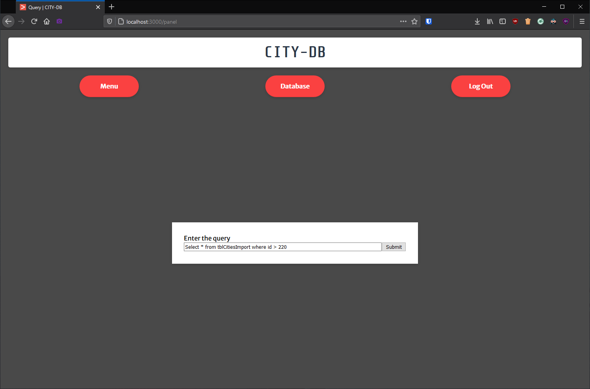
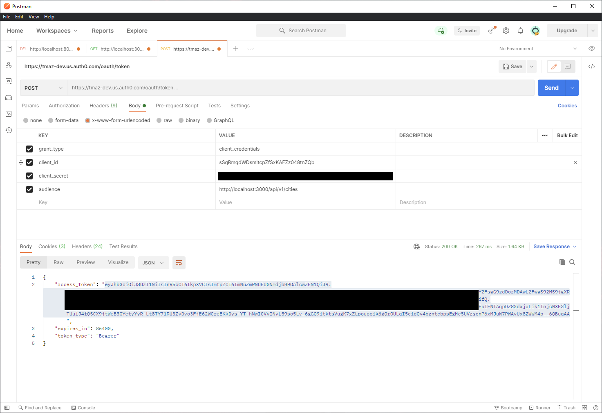

## Website Screenshots

1. Homepage (logged out)
   

2. Login Page
   
   

3. Homepage (logged in)
   

4. Main Menu/Account Info (all pages from here require Auth0 login)
   

5. Database Table View
   

6. Clicking on a city name brings you to a Detail View
   

7. Query Page
   

8. Query Results
   
   

## API Screenshots

1. Obtaining a token from Auth0
   

2. Public endpoint (no token needed)
   

3. Attempting to access private endpoint without auth token results in an error
   

4. Once you include auth token in the header, the request is successful
   

5. Successful POST request with token
   